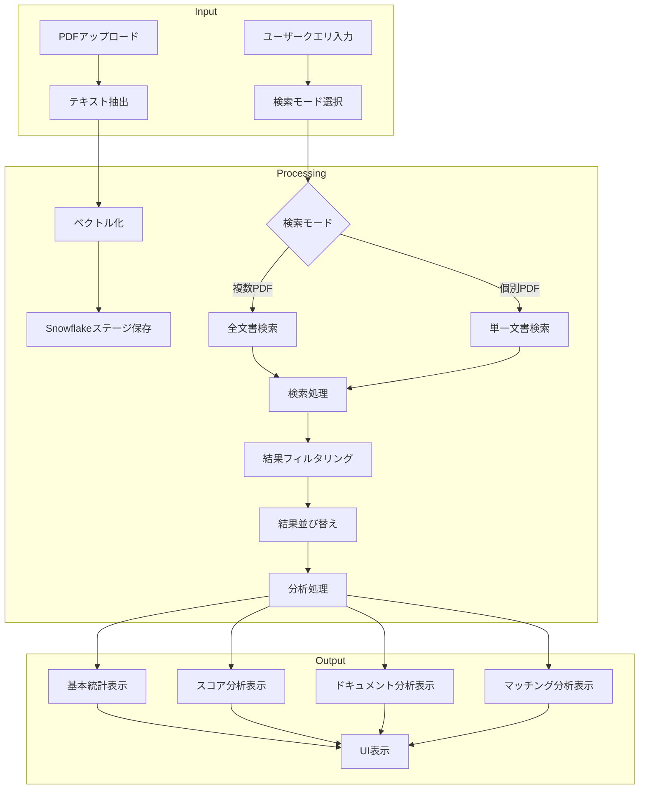
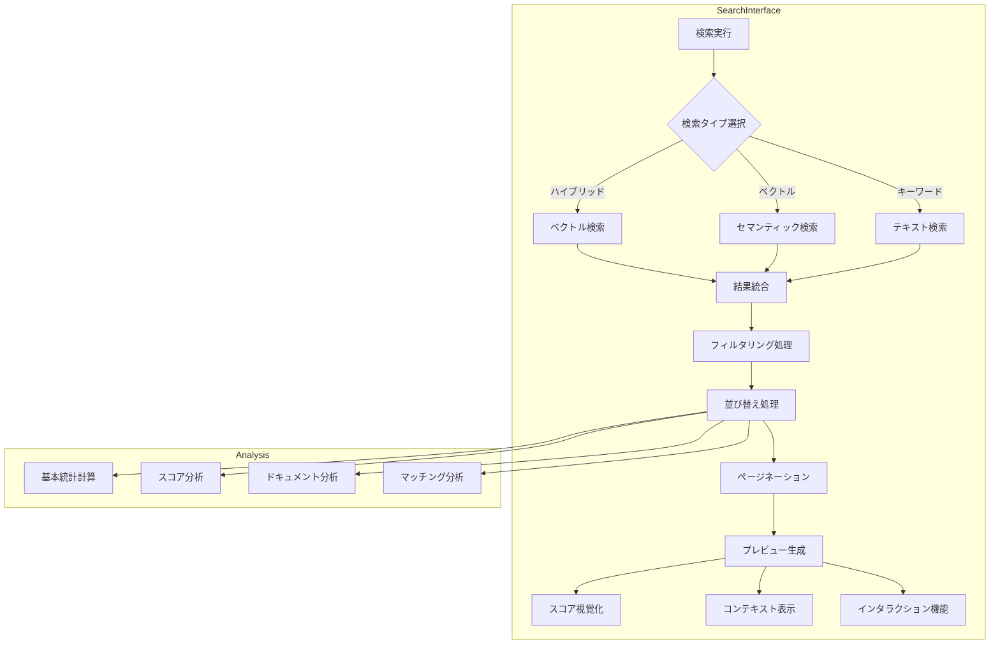
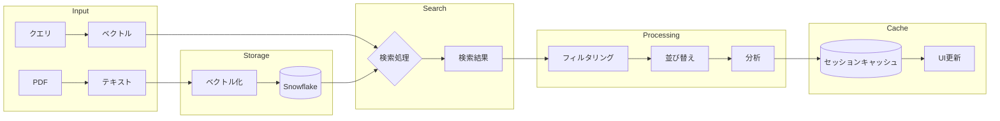
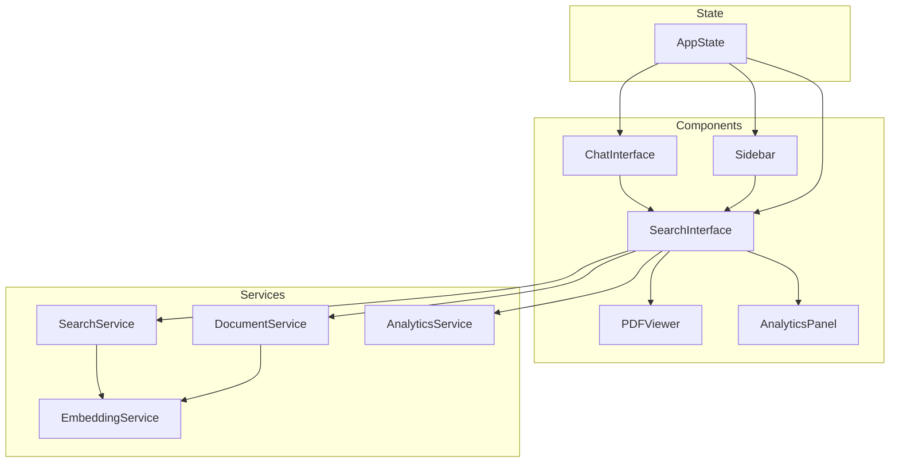

# ChatPDF処理構造図

## 基本フロー

```mermaid
graph TB
    subgraph Input
        A[PDFアップロード] --> B[テキスト抽出]
        Q[ユーザークエリ入力] --> S[検索モード選択]
    end

    subgraph Processing
        B --> C[ベクトル化]
        C --> D[Snowflakeステージ保存]
        
        S --> E{検索モード}
        E -->|複数PDF| F[全文書検索]
        E -->|個別PDF| G[単一文書検索]
        
        F --> H[検索処理]
        G --> H
        
        H --> I[結果フィルタリング]
        I --> J[結果並び替え]
        J --> K[分析処理]
    end

    subgraph Output
        K --> L[基本統計表示]
        K --> M[スコア分析表示]
        K --> N[ドキュメント分析表示]
        K --> O[マッチング分析表示]
        
        L --> P[UI表示]
        M --> P
        N --> P
        O --> P
    end
```

## 検索インターフェース処理

```mermaid
graph TB
    subgraph SearchInterface
        A[検索実行] --> B{検索タイプ選択}
        
        B -->|ハイブリッド| C1[ベクトル検索]
        B -->|ベクトル| C2[セマンティック検索]
        B -->|キーワード| C3[テキスト検索]
        
        C1 --> D[結果統合]
        C2 --> D
        C3 --> D
        
        D --> E[フィルタリング処理]
        E --> F[並び替え処理]
        
        F --> G[ページネーション]
        G --> H[プレビュー生成]
        
        H --> I[スコア視覚化]
        H --> J[コンテキスト表示]
        H --> K[インタラクション機能]
    end
    
    subgraph Analysis
        F --> L[基本統計計算]
        F --> M[スコア分析]
        F --> N[ドキュメント分析]
        F --> O[マッチング分析]
    end
```

## データ処理フロー

```mermaid
graph LR
    subgraph Input
        A[PDF] --> B[テキスト]
        Q[クエリ] --> V[ベクトル]
    end
    
    subgraph Storage
        B --> C[ベクトル化]
        C --> D[(Snowflake)]
    end
    
    subgraph Search
        V --> E{検索処理}
        D --> E
        E --> F[検索結果]
    end
    
    subgraph Processing
        F --> G[フィルタリング]
        G --> H[並び替え]
        H --> I[分析]
    end
    
    subgraph Cache
        I --> J[(セッションキャッシュ)]
        J --> K[UI更新]
    end
```

## コンポーネント間の関係

```mermaid
graph TB
    subgraph Components
        A[SearchInterface] --> B[PDFViewer]
        A --> C[AnalyticsPanel]
        
        D[ChatInterface] --> A
        E[Sidebar] --> A
    end
    
    subgraph Services
        A --> F[SearchService]
        A --> G[DocumentService]
        A --> H[AnalyticsService]
        
        F --> I[EmbeddingService]
        G --> I
    end
    
    subgraph State
        J[AppState] --> A
        J --> D
        J --> E
    end
``` 